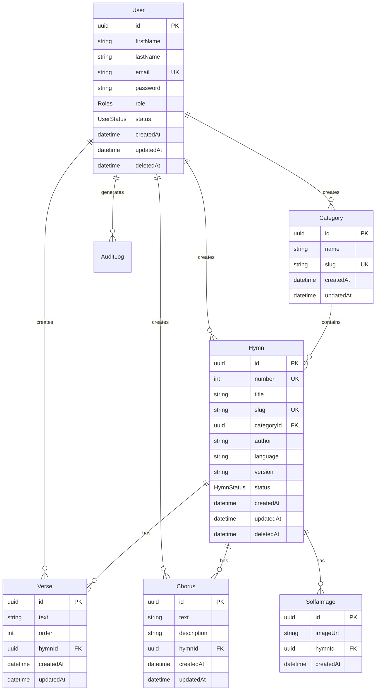

# Hymnal Backend — API Documentation

**Base URL:** `http://localhost:5000` (configurable via `APP_PORT` env)
**Swagger UI:** `GET /swagger`

---

## Response Format

All responses are wrapped by the global `ResponseInterceptor`:

```json
{
  "statusCode": 200,
  "message": "Human-readable success message",
  "data": { /* endpoint-specific payload */ }
}
```

**Error responses** follow standard NestJS HTTP exceptions:

```json
{
  "statusCode": 401,
  "message": "Unauthorized",
  "error": "Unauthorized"
}
```

---

## Authentication

Uses **JWT Bearer tokens**. Include in request headers:

```
Authorization: Bearer <token>
```

Two guard levels:
| Guard | Description |
|---|---|
| `JwtAuthGuard` | Requires any authenticated user |
| `AdminAuthGuard` | Requires authenticated user with `role: "Admin"` and `status: "Active"` |

---

## Rate Limiting

Global throttle: **10 requests per 60 seconds**. Some endpoints have custom limits (noted below).

---

## Endpoints

### 🔐 Auth — `/auth`

| Method | Endpoint | Auth | Description |
|--------|----------|------|-------------|
| `POST` | `/auth/signup` | ❌ | Create a new account |
| `POST` | `/auth/login` | ❌ | Login & get JWT token |
| `POST` | `/auth/logout` | ✅ JWT | Logout (invalidates session) |
| `POST` | `/auth/change-password` | ✅ JWT | Change current password |
| `POST` | `/auth/request-reset-password` | ❌ | Request a password reset link |

---

#### `POST /auth/signup`

**Request Body:**

```json
{
  "firstName": "string",   // required
  "lastName": "string",    // required
  "email": "string",       // required, valid email
  "password": "string"     // required
}
```

**Response (201):**

```json
{
  "statusCode": 200,
  "message": "Account created successfully.",
  "data": {
    "id": "uuid",
    "firstName": "John",
    "lastName": "Doe",
    "email": "john@example.com",
    "role": "User",
    "status": "Active",
    "createdAt": "2026-01-01T00:00:00.000Z",
    "updatedAt": "2026-01-01T00:00:00.000Z"
  }
}
```

---

#### `POST /auth/login`

**Request Body:**

```json
{
  "email": "string",       // required, valid email
  "password": "string"     // required
}
```

**Response (200):**

```json
{
  "statusCode": 200,
  "message": "User logged in successfully.",
  "data": {
    "token": "eyJhbGciOiJIUzI1NiIs...",
    "user": {
      "id": "uuid",
      "firstName": "John",
      "lastName": "Doe",
      "email": "john@example.com",
      "role": "User",
      "status": "Active",
      "createdAt": "...",
      "updatedAt": "..."
    }
  }
}
```

---

#### `POST /auth/logout`
🔒 **Requires:** `JwtAuthGuard`

No request body needed, just the `Authorization` header.

**Response (200):**

```json
{
  "statusCode": 200,
  "message": "User logged out successfully.",
  "data": { "message": "Logout successful" }
}
```

---

#### `POST /auth/change-password`
🔒 **Requires:** `JwtAuthGuard`

**Request Body:**

```json
{
  "oldPassword": "string",   // required
  "newPassword": "string"    // required
}
```

---

#### `POST /auth/request-reset-password`

**Request Body:**

```json
{
  "email": "string"   // required
}
```

> [!NOTE]
> The actual email sending is currently disabled (commented out). The endpoint returns a success message without sending an email.

---

### 🎵 Hymns — `/hymns`

| Method | Endpoint | Auth | Description |
|--------|----------|------|-------------|
| `POST` | `/hymns` | ✅ Admin | Create a new hymn (multipart/form-data) |
| `GET` | `/hymns` | ❌ | Fetch all hymns (paginated, filterable) |
| `GET` | `/hymns/:id` | ❌ | Fetch a single hymn by ID |
| `PATCH` | `/hymns/:id` | ✅ JWT | Update a hymn |
| `PATCH` | `/hymns/:id/delete` | ✅ Admin | Soft-delete a hymn |
| `DELETE` | `/hymns/:id` | ✅ Admin | Permanently delete a hymn |
| `POST` | `/hymns/:id/restore` | ✅ Admin | Restore a soft-deleted hymn |

---

#### `POST /hymns`
🔒 **Requires:** `AdminAuthGuard`
📎 **Content-Type:** `multipart/form-data`

**Form Fields:**

| Field | Type | Required | Description |
|-------|------|----------|-------------|
| `title` | string | ✅ | Hymn title |
| `number` | integer | ❌ | Hymn number (unique) |
| `categoryId` | UUID | ❌ | Category reference |
| `author` | string | ❌ | Hymn author |
| `language` | string | ❌ | Language (e.g., "English") |
| `version` | string | ❌ | Version identifier |
| `image` | file | ❌ | Solfa image (uploaded to Cloudinary) |
| `verses` | JSON string | ❌ | Array of `{ text: string, order?: number }` |
| `choruses` | JSON string | ❌ | Array of `{ text: string, order?: number }` |

> [!IMPORTANT]
> The `verses` and `choruses` fields must be sent as **JSON strings** (not parsed objects) when using `multipart/form-data`.

**Response (201):**

```json
{
  "statusCode": 200,
  "message": "Hymn created successfully.",
  "data": {
    "id": "uuid",
    "number": 1,
    "title": "Amazing Grace",
    "slug": "amazing-grace",
    "categoryId": "uuid",
    "author": "John Newton",
    "language": "English",
    "version": null,
    "status": "Published",
    "createdById": "uuid",
    "updatedById": "uuid",
    "createdAt": "...",
    "updatedAt": "...",
    "deletedAt": null,
    "verses": [
      { "id": "uuid", "text": "Amazing grace...", "order": 1, "hymnId": "uuid", ... }
    ],
    "choruses": [
      { "id": "uuid", "text": "Chorus text...", "order": 1, "hymnId": "uuid", ... }
    ],
    "solfaImages": [
      { "id": "uuid", "imageUrl": "https://res.cloudinary.com/...", "hymnId": "uuid", ... }
    ],
    "category": { "id": "uuid", "name": "Worship", "slug": "worship", ... }
  }
}
```

---

#### `GET /hymns`
⏱️ **Rate limit:** 5 requests per 20 seconds

**Query Parameters:**

| Param | Type | Default | Description |
|-------|------|---------|-------------|
| `term` | string | — | Search by title (contains), number (exact), or author (contains) |
| `cursor` | base64 string | — | Cursor for pagination |
| `size` | integer (1–100) | — | Page size |
| `direction` | `asc` / `desc` | `desc` | Sort direction |
| `orderBy` | string | `createdAt` | Field to order by |

**Response (200):** Returns paginated hymn list with `category` included.

---

#### `GET /hymns/:id`
⏱️ **Rate limit:** 5 requests per 20 seconds

**Response (200):** Returns a single hymn with `category`, `choruses`, and `verses` (ordered by `order: asc`).

---

#### `PATCH /hymns/:id`
🔒 **Requires:** `JwtAuthGuard`

**Request Body (JSON):** — all fields optional

```json
{
  "number": 1,
  "title": "string",
  "categoryId": "uuid",
  "author": "string"
}
```

---

#### `PATCH /hymns/:id/delete`
🔒 **Requires:** `AdminAuthGuard`

Soft-deletes the hymn and all related verses/choruses.

---

#### `DELETE /hymns/:id`
🔒 **Requires:** `AdminAuthGuard`

Permanently deletes the hymn, all related verses, and choruses. Creates an audit log entry.

---

#### `POST /hymns/:id/restore`
🔒 **Requires:** `AdminAuthGuard`

Restores a previously soft-deleted hymn and all related verses/choruses.

---

### 📁 Categories — `/category`

| Method | Endpoint | Auth | Description |
|--------|----------|------|-------------|
| `POST` | `/category` | ✅ JWT | Create a category |
| `GET` | `/category` | ✅ JWT | Fetch all categories |
| `GET` | `/category/:id` | ✅ JWT | Fetch a single category |
| `PATCH` | `/category/:id` | ✅ JWT | Update a category |
| `PATCH` | `/category/:id` | ✅ JWT | Delete a category |

---

#### `POST /category`
🔒 **Requires:** `JwtAuthGuard`

**Request Body:**

```json
{
  "name": "string",           // required
  "description": "string"     // optional
}
```

---

### 👥 Users — `/users`

| Method | Endpoint | Auth | Description |
|--------|----------|------|-------------|
| `GET` | `/users` | ✅ JWT | Fetch all users |
| `GET` | `/users/:id` | ✅ JWT | Fetch a single user |
| `POST` | `/users` | ✅ JWT | Create a user (stub) |

> [!NOTE]
> The `POST /users` endpoint currently returns a placeholder string. User creation is handled via `POST /auth/signup`.

---

### 🎶 Choruses — `/chorus`

| Method | Endpoint | Auth | Description |
|--------|----------|------|-------------|
| `POST` | `/chorus` | ✅ JWT | Create a chorus |
| `GET` | `/chorus/:id` | ✅ JWT | Fetch a chorus |
| `PATCH` | `/chorus/:id` | ✅ JWT | Update a chorus |
| `PATCH` | `/chorus/:id` | ✅ JWT | Delete a chorus |

#### `POST /chorus`

**Request Body:**

```json
{
  "hymnId": "uuid",    // required
  "text": "string"     // required
}
```

---

### 📖 Verses — `/verses`

| Method | Endpoint | Auth | Description |
|--------|----------|------|-------------|
| `POST` | `/verses` | ✅ JWT | Create a verse |
| `GET` | `/verses/:id` | ✅ JWT | Fetch a verse |
| `PATCH` | `/verses/:id` | ✅ JWT | Update a verse |
| `PATCH` | `/verses/:id` | ✅ JWT | Delete a verse |

#### `POST /verses`

**Request Body:**

```json
{
  "hymnId": "uuid",    // required
  "text": "string",    // required
  "order": 1           // optional, integer
}
```

---

## Data Models



## Enums

| Enum | Values |
|------|--------|
| `Roles` | `Admin`, `User` |
| `UserStatus` | `Active`, `Inactive` |
| `HymnStatus` | `Published`, `Draft`, `UnderReview`, `Archived` |
| `ActionType` | `CREATE`, `UPDATE`, `DELETE`, `LOGIN`, `LOGOUT` |
| `EntityType` | `USER`, `HYMN`, `CATEGORY`, `VERSE`, `CHORUS`, `SOLFA_IMAGE` |

---

## Environment Setup

Required `.env` variables for frontend integration:

```bash
APP_PORT=5000                    # Backend port
APP_HOST=http://localhost:5000   # Backend URL
JWT_SECRET=your-secret           # JWT signing key
JWT_EXPIRES_IN=3600000           # Token expiry (ms)
DATABASE_URL=postgresql://...    # PostgreSQL connection
REDIS_HOST=localhost             # Redis for session caching
REDIS_PORT=6379
```
